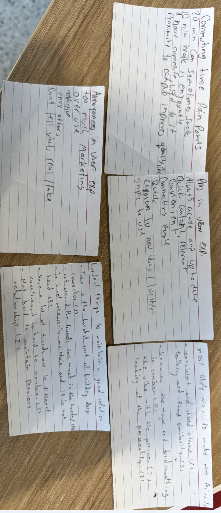

Jaime -  

Jaime is a senior full time computer science student who loves technology and problem solving. He spends his weekdays going to sleep early, works, wakes up early, and relaxes on the weekends. He commutes 20 minutes to campus and enjoys it sometimes and feels that commuting does not affect his social life. Did not know anyone at Temple before coming here but is from Philadelphia. Enjoys the fact that he lives close to his family. Jamie believes that a communications class would benefit him in an interview environment. The strategy that he uses when making new friends is meeting people who have a consistent shared environment, shared interests, same classes, and through basketball. He says that his friend group has a lot of different ethnic backgrounds, but mostly they are also computer science students. He does not feel disconnected from the people he interacts with daily but only mildly connected. He says that time is the hardest part of building deeper connections with people; being busy can limit connections. He does not find it difficult to maintain personal relationships. If he faces an issue, his first move is to ask Google what to do, but he would ask a person first if the problem was interpersonal.  

 

Dylon 

Dylon is a senior Cybersecurity major from New Jersey. He transferred here sophomore year because he wanted to be closer to home. Dylon had friends he grew up with who go to Temple as well, and he enjoys being in the city environment. He enjoys the diversity at Temple and thinks that North Philadelphia is cool. On weekdays he wakes up at 7:30 and goes to class from 8:00 to 3:00. Dylon has Saturdays free to relax and then works from 5:30 to midnight at the Met on Sundays. He lives a 10-minute walk from campus and feels that it is the ideal living situation because he does not have to deal with parking. He goes out to parties on the weekends because he lives so close to campus and states that he would not attend if he lived any further. He is from North Philadelphia and shared that he “knew half of Temple” from going to high school nearby. His family lives in New Jersy so has a medium distance commute to see them. When asked, he says he would take a communications course and use those lessons in everyday life. He finds that the best way to make friends is to talk about similarities and make jokes depending on the situation. Dylon met the majority of his friends from work, class, gym, and everyday interaction. He is surrounded by different types of friends for each different faucet of life, depending on the shared interest such as friends for working out with, or partying, but believes that the common shared trait between the majority is ambition. Feeling disconnected with the people he interacts with daily is a pain point that he finds difficult through maintaining previous relationships. Because of this he is not around them as much and finds it difficult to keep in contact. His main form of communication is facetiming. When he faces a problem throughout his day, his first place to ask for a solution in ChatGPT but would ask a person first over ChatGPT if it was a homework problem. 

 

Riju 

Riju is a senior computer science major. He is working on his capstone project, is a research assistant, and working on independent research. He chose computer science because it seemed the most interesting to him. He started his Temple career at the Japan campus and transferred to the Philadelphia campus Fall 2025. He has had a good experience in Philadelphia and at Temple. At school he enjoys the facilities, study locations, and finds his classes interesting. Currently he is living in the dorms where he shares a room with his roommate, although he would prefer to have his own room. Riju feels that he lives in the best proximity to campus for making meaningful connections by living as close to Temple as possible. He knew a few people coming from the Japan campus to the Philly campus with him but did not know anyone who was already here. While living in Japan he did have an hour-long commute and did not know anyone before his classes started. He believes that he would apply for the lessons he would learn from a communications class in his everyday life. When meeting new people his go to strategy is to ask someone what their major is hoping that allows them to have something in common, considering that most of his friends are from the same major as him. He tries to surround himself with people who have similar interests. He feels connected to the people he hangs out with daily but disconnected to the people he sees once or twice a week. It isn’t difficult to maintain new friendships for Riju, the way that he views maintaining previous friendships from other countries is that he does not need current updates and enjoys going back and picking up where he left off regardless of time spent without communication when regarding his closest friends. His main method of communication is through messaging and phone, and also through class. When he faces a problem during the day, he would reach out to a person before any platform looking for advice, but not for a solution.  

Judy 

Judy is a junior Bioengineering student who transferred to Temple with people that she knew so that she would feel more at home here. Since coming to Temple, she has not socialized as much as she would have liked to because it is only her second semester at Temple. Judy has been having a little bit of a hard time because she is shy but knows she has a good personality once she opens up. During the weekdays she is active going to clubs and hanging out with her friends she met in class, and out of class. During the weekends she spends time at home she likes to decompress and “rot”. She is currently in her ideal living conditions where she has roommates to socialize with but still gets her alone time two days a week where she can rest for socializing. She is currently a walkable distance from campus and wouldn't mind a walk that is under 20 minutes to campus. She enjoys staying at school as late as possible instead of going straight home. She is an international student. She took a communications class and did not enjoy it because it was about theory and presentations with little peer interactions and got closer with the professor than the students. When she is meeting new friends her method involves looking for a vibe that seems sweet and approachable, if she smiles at someone and they smile back she will go up to them and start a conversation to see if they vibe and ask to hang out another time depending on how that goes. Otherwise, she sticks to hanging out with her classmates. Her friend group that she has now is from her first day of class that hung out afterwards. She aims to surround herself with people who have similar values because she believes that her friends shape her personality. Most of her friends are international with cultural similarities because she looks more towards local friends. She feels very connected and involved with the people she interacts with daily. When it comes to new relationships, she says that it's important to give personal space with intentional gaps because new friendships take adjusting and getting to know each other from surface level to deeper. She finds it difficult to maintain relationships because a lot of her friends are in other countries and trying to keep in touch with texting does not feel like enough. She uses Instagram often because of the life updates with low commitment that makes her feel connected to her friends without a forced reply. When she is faced with a dilemma, her first solution is to ask a person who knows her well for advice because they are already updated on everything going on in her life. The only time she would use Google first would be if it was a random question.  

 

Zinnia 

Zinnia is a junior mechanical engineering major who enjoys reading. She has been enjoying her time at Temple so far. Even though they had only have been here for a month, she finds it “chill and fun” with new friends and enjoys classes. She knew one person before coming to Temple. Her schedule during the weekdays is very regimented and packed while the weekend is relaxed with no routine. She is currently in her ideal living situation where she is living with friends, has independence, a 10-minute walk from campus, and has someone she can talk to when she wants. She believes that she would apply lessons learned from a communication class in a work environment but not in an interpersonal setting. Her go to strategy when making new friends is to see if their personality's click and not force anything, the first conversation matters. She has met her friends through classes and friends and chooses to surround herself with funny people. She finds similar interests important because her friends know everything about her. Sometimes she feels disconnected from the people she interacts with daily because of a language barrier. She states that coming from a foreign country means that there are different communication styles that intern create different friendship approaches. She does not find it difficult to maintain previous relationships. She enjoys how Instagram is informal and how you can share interest lightly but is annoyed that you cannot preview messages. Her main form of commutation is texting and calling. When she is faced with a problem during her day, her first step is to ask ChatGPT and then she reaches out to her parents.  

 

 

 

User Survey Summary 
24 Responses 

Our survey yielded plenty of responses that gave us insights into people's ways they connect with others. We had many people from different majors, although many were computer science as we sent to friends. Getting ranges for socializations on weekends and weekdays helps us compare and decide on a common average between people.  
 
Key takeaways: 

Most people are not from the Philadelphia area 
Weekday range for socialization mainly shows a 5 range 
Weekend range for socialization leans towards higher 7-9 range 
The closer to campus, the more people thing connections would be more meaningful 
Most common way people met friends is through classes, also on campus organizations 
Most people have shared interests with friends 
If a person faces a personal / relationship issue they prefer discussing with a friend 
Most people said they prefer having roommates over none, with the most popular responses being 2 or 3. 
Around half said they live near family, the other do not 
 
Persona 1 
 

Bio 
 

Judy is a junior student in Bioengineering major at Temple University. She lives at off-campus housing and takes about 5 min to come to the campus.  
 

Goals 
 

Living in a walking distance from the campus.  
Make new friends that match her vibe. 
Get more local friends. 
 

Frustrations 
 

It's hard to build new connectings with new people because of personal space and intentional gaps. 
It's hard to maintain a previous relationship. 
Not having any social connection during weekends. 
 

Motivations 
 

Having a match vibe with each other 
Same class 
 

Behaviors 
 

Texting through Instagram and snapping for communications with friends and family. 
Would reach out to google random facts and reach out to the person if it is human interaction problems. 
Defining quote 
 

New relationships are hard to charge and talk because they are both new to each other, so there must be personal space, intentional gaps because it takes time. 
 

Persona 2 
 

Bio 
 

Jamie is a full-time senior in Computer Science Major at Temple University. He lives 20 minutes far from the campus and he is a commuter.  
 

Goals 
 

Having a family close nearby 
To sleep earlier on weekdays and relax during weekends. 
Frustrations 
 

Giving time to friends. 
Feeling a mild connection with old friends.  
Getting ads while using social media platforms. 
Having a long communting time 
 

Motivations 
 

Having same environment and consistency with the friends 
Having shared interests and the same class. 
 

Behaviours 
 

Speaking and talking in person is the main form of application 
Will reach out to Google first when he encounters a problem. 
 

Defining quote 
 

I don’t feel disconnected but mild connections. The connection isn’t as deep as it used to be. 

Insight Statement 1 
 

We observed that 5 out of 5 interviews and 100% of the survey responded that having too much commuting time would be very hard to make new friends and to be able to participate in social events. 
As Jamie(commuter persona) said that having more than 20 minutes commuting time makes it harder to make friends and participate in the social events. As we look at the survey, we can also see that having a shorter commuting time would help to make more connections.  
This suggests that we have to put in the feature that would help the commuters to communicate during their wait time and hang out with the people.  
 

Insight Statement 2 
 

We observed that 4 out of the interviews and 71% of the survey responded that they do not communicate well with the school friends during the weekends.   
As Judy(off-campus persona) said that she barely communicates with the friends from the school during the weekends. Although she has time to communicate and hang out with the classmates during weekdays, it is hard for her to hang out during weekends. If we also look at the survey, eight people say they barely communicate or not communicate at all during weekends.  
This suggests that we have to put in a feature that would allow the users to create the events that they want to meet and hang out with their friends at their preferred time. 
 

 

